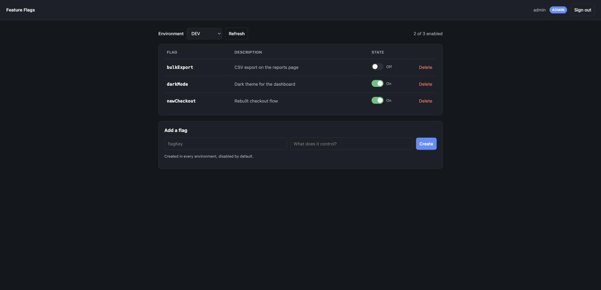

# Feature Flag as a Service

A Spring Boot service for turning features on and off per environment, without a redeploy.
An admin signs in to a web page, flips a switch, and every other service sees the change on its
next evaluation call.



## What works today

- **Role-based auth** — JWT bearer tokens, with HTTP Basic kept as a fallback for scripts
- **Admin page** — sign in, pick an environment, toggle flags, add and delete them
- **Evaluation API** — public, cached in process, for other services to call
- **Per-org targeting** — opt one org into a flag that is off, or out of one that is on
- **Five environments** seeded at startup: DEV, Local, QA, PreLive, Production

## Running it

Needs **JDK 17+** and a **MySQL** running on `localhost:3306` with a database named
`feature_flag_db`. Tables are created automatically (`ddl-auto=update`).

```bash
./mvnw spring-boot:run
```

Then open **http://localhost:9090** and sign in as `admin` / `admin123`.

Run the tests with `./mvnw test` (64 tests; the `@SpringBootTest` ones need MySQL up).

## Using a flag from another service

The evaluation endpoint needs no authentication, so a calling service just asks:

```bash
curl "http://localhost:9090/api/v1/default/evaluate?flag=newCheckout&environment=DEV"
# true
```

Answers are cached in process and evicted the moment someone toggles the flag, so a change in
the admin page is visible on the very next call — no waiting for a TTL.

Pass `orgId` and the answer respects any override set for that org:

```bash
curl "http://localhost:9090/api/v1/default/evaluate?flag=newCheckout&environment=DEV&orgId=60021234567"
```

Each data centre runs its own instance, so "enable for this DC" means toggling the flag in that
DC's deployment. Overrides carry a `scope` column (`ORG`, `DC`, `USER`) so wiring another
dimension later is a code change rather than a migration — only `ORG` is evaluated today.

## API

Every `/api/v1/**` endpoint needs `Authorization: Bearer <token>` except `evaluate`.

| Method | Path | Role | Purpose |
|---|---|---|---|
| POST | `/auth/login` | — | `{username, password}` → `{token, username, role, expiresIn}` |
| GET | `/api/v1/{app}/evaluate?flag=&environment=&orgId=` | — | `true` / `false` — the hot path. `orgId` optional |
| GET | `/api/v1/environments` | VIEWER+ | List environments |
| GET | `/api/v1/{app}/flags?environmentId=` | VIEWER+ | Flags and their state in one environment |
| GET | `/api/v1/{app}/flags/{flagId}?environmentId=` | VIEWER+ | One flag's state |
| POST | `/api/v1/{app}/flags` | EDITOR+ | `{name, description, environmentId:[…]}` → `201` |
| PATCH | `/api/v1/{app}/flags/{flagId}` | EDITOR+ | `{enabled, environmentId}` — the toggle |
| DELETE | `/api/v1/{app}/flags/{flagId}` | ADMIN | `204` |
| GET | `/api/v1/{app}/flags/{flagId}/overrides?environmentId=` | VIEWER+ | Org overrides on a flag |
| POST | `/api/v1/{app}/flags/{flagId}/overrides` | EDITOR+ | `{orgId, enabled, environmentId}` → `201` |
| DELETE | `/api/v1/{app}/flags/{flagId}/overrides/{overrideId}` | ADMIN | `204` |
| POST | `/api/v1/application` | EDITOR+ | Register an application |

Roles are `VIEWER` (read), `EDITOR` (toggle and create), `ADMIN` (also delete).

```bash
TOKEN=$(curl -s -X POST localhost:9090/auth/login \
  -H 'Content-Type: application/json' \
  -d '{"username":"admin","password":"admin123"}' | jq -r .token)

curl -H "Authorization: Bearer $TOKEN" localhost:9090/api/v1/default/flags?environmentId=1
```

## How it fits together

```
Browser ──► /            static admin page (HTML + vanilla JS)
        └─► /api/v1/**   JwtAuthFilter → role rules → Controller → Service
                                                                    │
Other service ──► /evaluate ──► FlagCache ──(miss only)──► Repository ──► MySQL
                                    ▲
                                    └── evicted on every toggle
```

| Layer | Package | Note |
|---|---|---|
| Security | `security` | `JwtService`, `JwtAuthFilter`, JSON 401/403 handlers |
| Cache | `cache` | `FlagCache` interface + Caffeine implementation |
| Evaluation | `evaluation` | `FlagRules` — the environment default plus its org overrides |
| Web | `controller` | Thin; DTOs in `controller/input` and `controller/output` |
| Domain | `service`, `model`, `repository` | Spring Data JPA |

## Configuration

| Property | Default | |
|---|---|---|
| `server.port` | `9090` | |
| `app.jwt.secret` | dev value | **Override via `APP_JWT_SECRET` outside local dev** |
| `app.jwt.expiration-minutes` | `60` | |
| `app.cache.ttl-seconds` | `600` | Safety net only; writes evict eagerly |
| `app.cache.max-size` | `10000` | `0` disables the cache |
| `app.seed.admin-password` | `admin123` | Password for the seeded `admin` user |

> The default JWT secret is committed to this repository and the app warns about it at startup.
> Anyone who can read this repo could mint an `ADMIN` token against an instance that has not set
> `APP_JWT_SECRET`. Set it before running this anywhere but your own machine.

## Design notes

- **Optimistic locking** — a `version` column on flag state; a concurrent toggle gets `409`.
- **Misses are not cached.** Evaluating a flag that does not exist returns `false` without
  storing it, so creating the flag later is visible immediately rather than after the TTL.
- **The cache removes database load, not latency.** Measured on a laptop with local MySQL,
  200 evaluations went from 200 SQL queries to 0, while wall-clock time was unchanged at
  ~0.15 ms per request — the bottleneck at this scale is HTTP, not the query. It starts
  mattering when the database is a network hop away or under connection-pool contention.
- **The cache stores rules, not answers.** Keying on `(flag, app, environment)` and resolving
  the org in memory keeps the entry count at flags × environments. Keying on the org instead
  would multiply it by every org and never warm: measured, 100 evaluations for 100 different
  orgs cost **0** queries.
- **`FlagCache` is an interface** so a shared implementation (Redis) can replace the in-process
  one. Every write path evicts a single key, which is one `DEL` in Redis.

## Not built

Deliberately out of scope for this POC, in rough order of what would come next:

1. **Per-application isolation** — flags all belong to one seeded `default` application, and the
   `{app}` path variable is not checked against the flag being addressed.
2. **Overrides in the admin page** — they are API-only today; the page shows the environment
   default, not which orgs deviate from it.
3. **Per-user and per-DC targeting** — the `scope` column supports `USER` and `DC`, but only
   `ORG` is resolved. Like `orgId`, either would be a request parameter rather than the
   authenticated caller, since the end user of a calling service never authenticates here.
4. **Token revocation** — a token is valid until it expires; signing out only drops it locally.
5. **Audit trail, Kafka/outbox, Redis** — design targets from the original sketch, not implemented.
