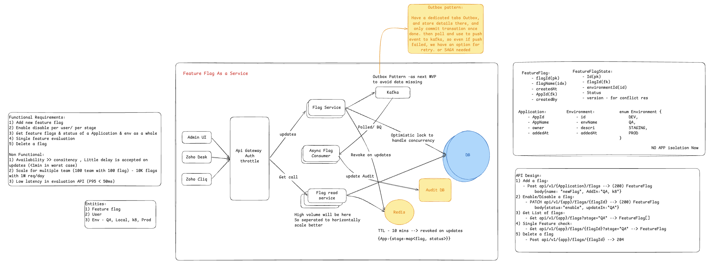

# Feature Flag as a Service

A Spring Boot service for managing feature flags across applications and environments (DEV / QA / STAGING / PROD) — enable or disable features per app and per stage without redeploying.

## Architecture



## Requirements

**Functional**
1. Add a new feature flag
2. Enable / disable per user, per stage
3. Get feature flags & status of an application + environment as a whole
4. Single feature evaluation
5. Delete a flag

**Non-functional**
1. Availability over consistency — small delay acceptable on updates (< 1 min worst case)
2. Scale: ~100 teams × 100 flags (10K flags), 1M req/day
3. Low-latency evaluation API (P95 < 50 ms)

## API Design

| # | Endpoint | Description |
|---|----------|-------------|
| 1 | `POST /api/v1/{app}/flags` | Add a flag — body `{"name": "newFlag", "addIn": "QA"}` → `200 FeatureFlag` |
| 2 | `PATCH /api/v1/{app}/flags/{flagId}` | Enable/disable — body `{"status": "enable", "updateIn": "QA"}` → `200 FeatureFlag` |
| 3 | `GET /api/v1/{app}/flags?stage=QA` | List flags for an app + stage → `FeatureFlag[]` |
| 4 | `GET /api/v1/{app}/flags/{flagId}?stage=QA` | Single feature check → `FeatureFlag` |
| 5 | `DELETE /api/v1/{app}/flags/{flagId}` | Delete a flag → `204` |

## Design Notes

- **Split read/write paths** — evaluation (read) traffic is high volume, so the flag read service is separated to scale horizontally; Redis cache (TTL 10 min, revoked on updates) keeps evaluation latency low.
- **Outbox pattern (next MVP)** — writes commit flag + outbox row in one transaction; a poller publishes to Kafka, so events survive failures with retry instead of needing a SAGA.
- **Optimistic locking** — version column on flag state handles concurrent updates.
- **Audit trail** — flag changes recorded in a dedicated audit DB.

## Running Locally

Requires JDK 17+.

```bash
./mvnw spring-boot:run
```

The app starts on port **9090**:

```bash
curl http://localhost:9090/api/v1/{app}/flags
```

## Status

Learning/design project — in-memory storage for now (no DB, no app isolation yet); Kafka, Redis, and the outbox flow are design targets, not yet implemented.
